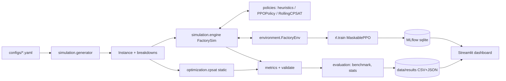

# Architecture

```mermaid
flowchart LR
  cfg[configs/*.yaml] --> gen[simulation.generator]
  gen --> inst[Instance + breakdowns]
  inst --> eng[simulation.engine FactorySim]
  eng <--> pol[policies: heuristics / PPOPolicy / RollingCPSAT]
  eng <--> env[environment.FactoryEnv]
  env --> ppo[rl.train MaskablePPO]
  inst --> cp[optimization.cpsat static]
  eng --> met[metrics + validate]
  cp --> met
  met --> ev[evaluation: benchmark, stats]
  ev --> res[(data/results CSV+JSON)]
  ppo --> ml[(MLflow sqlite)]
  res --> dash[Streamlit dashboard]
  ml --> dash
```
Heuristics, the RL env and the rolling CP-SAT all drive the same `FactorySim` through `advance()/candidates()/dispatch()`.
